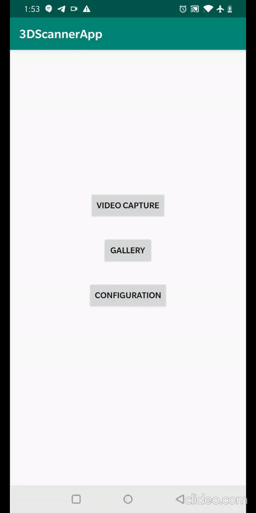

# ScannerApp
This is the Android ScannerApp for ScanNet.

## Basic Functionality
- Record scene video.
- Upload video to ScanNet server for processing.

## User Guide
You can find user instructions [here](https://docs.google.com/document/d/11eYY-jwGs3JQIrlqCW0JUCnOxLEHJJx-Pz4gFKXpcQM/edit?usp=sharing).

## How to use
You can download the apk from [here](https://drive.google.com/open?id=1KZLzXMf1lYieVskXnzhPuXwZLxmXmIDV). 
Or git clone the repo and rebuild in Android Studio
